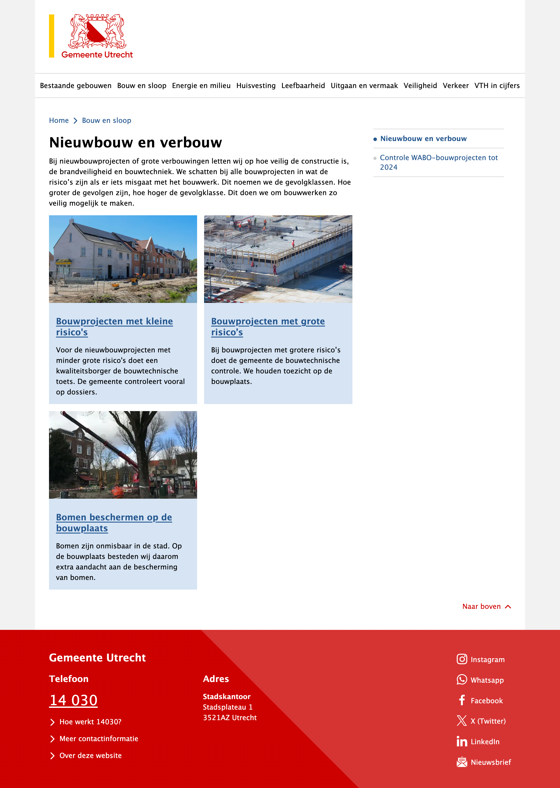

Voor de afdeling Veiligheid, Handhaving en Toezicht van gemeente Utrecht heeft Frameless een toegankelijke digitale versie gemaakt van de jaarpublicatie. Vroeger werd die als PDF gepubliceerd, maar vanaf 2023 is het verslag digitaal beschikbaar als onderdeel van de website van gemeente Utrecht.

Bekijk de website en lees het verslag op [vth-programma-verslag.digitaal.utrecht.nl](http://vth-programma-verslag.digitaal.utrecht.nl).

