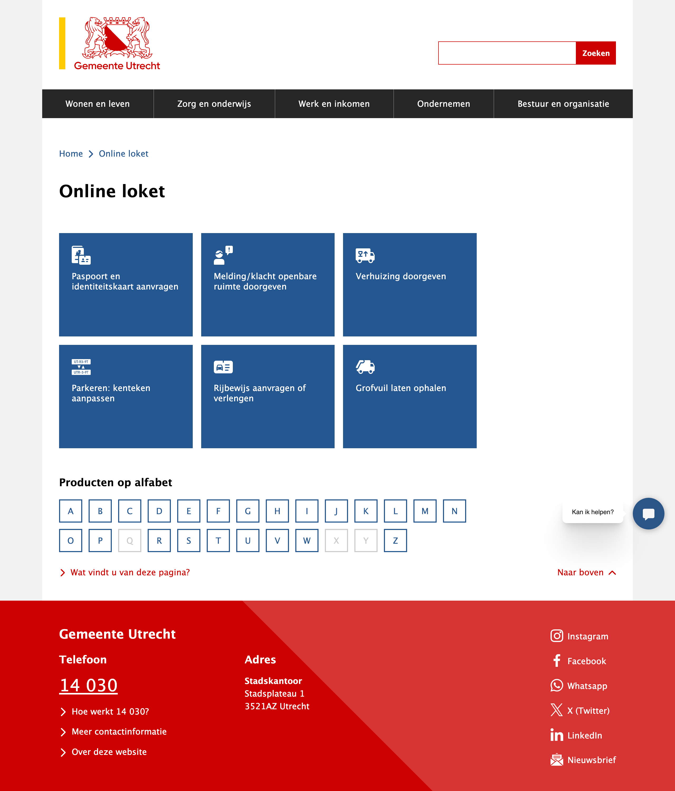

De nieuwe website van het Digitaal Loket van Utrecht is live! De website is gemaakt met React, Next.js, Open Formulieren en NL Design System. De backend is een Producten- en Dienstencatalogus (PDC) op basis van Strapi.

De afgelopen weken heeft de redactie hard gewerkt om de bestaande site te migreren naar het nieuwe systeem. Naast de productpagina's, zijn ook veel formulieren vernieuwd. De formulieren met DigiD zijn nu nog veiliger, je hoeft niet meer naar een andere subdomein om het formulier in te vullen.

