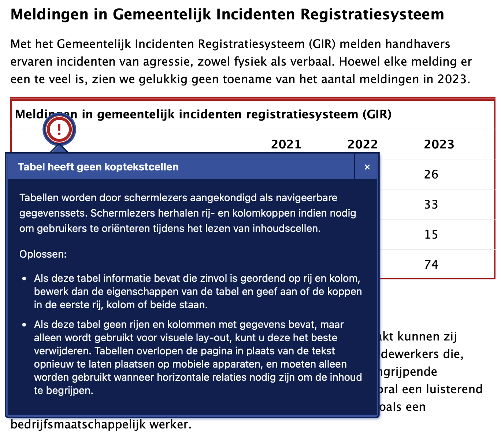

De redactie krijgt nu in Strapi direct te zien als er voor toegankelijkheid nog iets verbeterd kan worden. Wanneer je een pagina in het CMS bekijkt als "Preview", dan krijg je nu een waarschuwing te zien als de content nog niet digitaal toegankelijk is.

Als de techniek van de website digitaal toegankelijk is, ligt daarna de verantwoordelijkheid bij de redactie. Er zijn zoveel dingen om op te letten, dat een foutje makkelijk gemaakt is. Daarom helpen wij de redactie, door automatisch tips te geven voordat de pagina gepubliceerd wordt.

