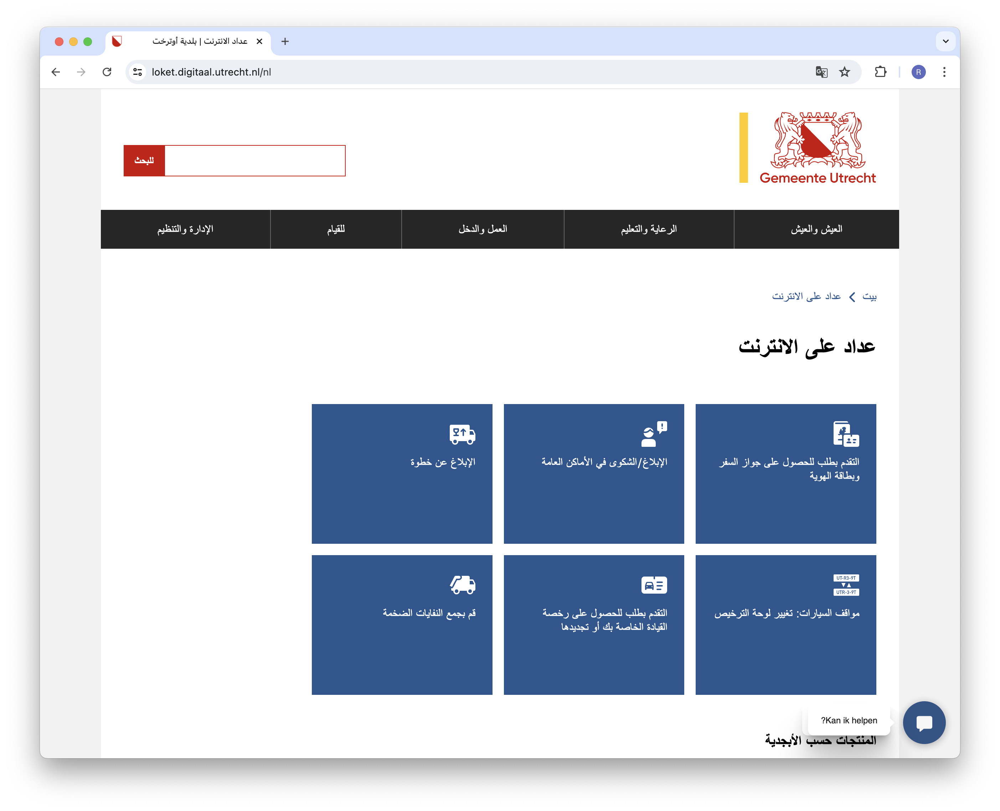
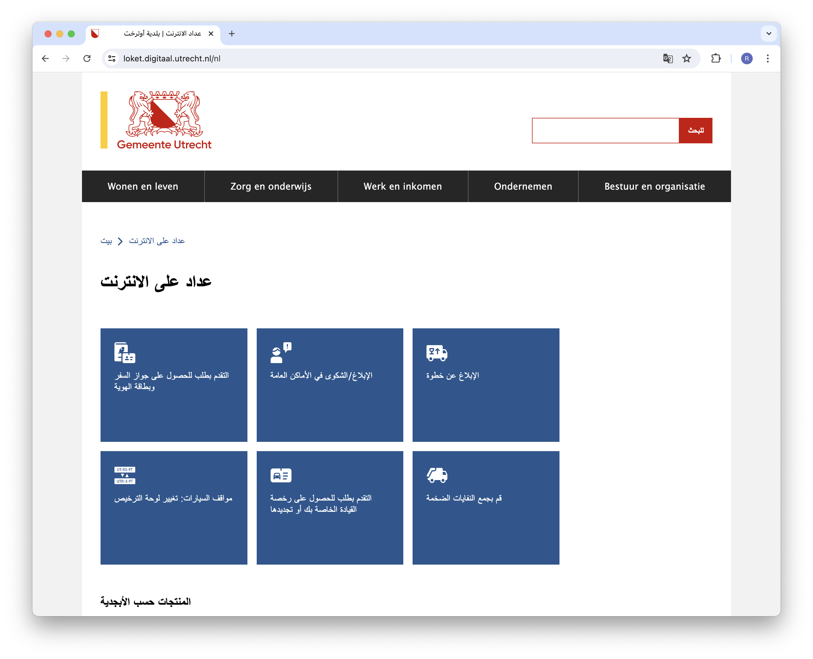

De website Digitaal Loket van Utrecht wordt nu automatisch gespiegeld, wanneer je met Google Translate de website naar Arabisch vertaalt — of een andere taal die van rechts naar links wordt geschreven. Dat maakt de website een stuk gebruiksvriendelijker voor een significant aantal bezoekers!

<!-- truncate -->

In maart 2023 heeft gemeente Utrecht in samenwerking met Frameless onderzoek gedaan naar hoeveel gebruikers de website in een andere taal bekijken, met behulp van Google Translate. Meer dan 5,8% van de bezoekers vertaalt de website zelf, want naast Google Translate zijn er veel andere populaire vertaaltools.

Eén van de populaire talen is Arabisch. Het bijzondere aan talen als Arabisch, Farsi, Hebreeuws is dat ze van rechts naar links zijn geschreven. Dat betekent dat ook de layout van websites in die taal gespiegeld is.

De meeste Nederlandse websites zijn niet gebruiksvriendelijk als ze vertaald zijn naar Arabisch, omdat de layout nog steeds van links naar rechts is, maar de tekst van rechts naar links gaat. De website ziet er dan helemaal niet uit zoals gebruikers verwachten.

NL Design System beschrijft in de architectuur dat de meest moderne webstandaard gebruikt moeten worden voor layout: [CSS Logical Properties and Values Level 1](https://www.w3.org/TR/css-logical-1/). Die standaard heeft het niet over "links" en "rechts", maar over "begin van de regel" en "eind van de regel", en "voor de tekstregel" en "na de tekstregel". Op die manier werkt de layout even goed van links naar rechts, als van rechts naar links.

Omdat nieuwe websites van gemeente Utrecht met NL Design System worden gebouwd, zijn die helemaal klaar voor internationale versies. We moesten nog één ding doen: herkennen dat Google Translate wordt gebruikt voor een taal die van rechts naar links wordt geschreven, en op dat moment de code `dir="rtl"` toevoegen. Dat is HTML-code voor: <strong>dir</strong>ection is <strong>r</strong>ight-<strong>t</strong>o-<strong>l</strong>eft.

Frameless heeft deze functionaliteit gratis toegevoegd aan de websites van Utrecht, in onze missie om de websites van Utrecht de meest toegankelijke, gebruiksvriendelijke en inclusieve gemeentewebsite van Nederland te laten zijn.

Het onderzoeksrapport kun je lezen op [gebruikersonderzoeken.nl](https://gebruikersonderzoeken.nl/): [Google Translate gebruik op utrecht.nl](https://gebruikersonderzoeken.nl/docs/onderzoek-bekijken/website-gebruik/utrecht-google-translate).

Wil jij ook in welke talen mensen jouw website bekijken? Dat kan! We hebben twee open source versies van onze analytics-code gepubliceerd: een versie voor [Matomo](https://github.com/Robbert/translate-test/blob/main/translate-matomo.js), en een versie voor [Google Tag Manager](https://github.com/Robbert/translate-test/blob/main/translate-google-tag-manager.js).
